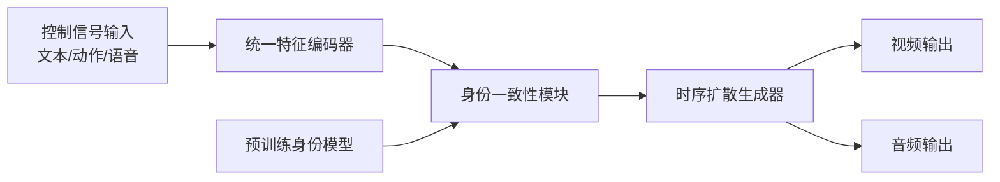
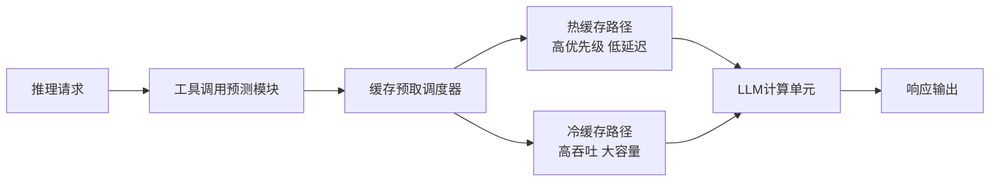

# Daily Papers Analysis - 2026-02-26
Total selected papers: 6 | Filter criteria: AI/ML/LLM preferred directions + top institutions + high-impact work

---

## DreamID-Omni: Unified Framework for Controllable Human-Centric Audio-Video Generation
### 基础信息
- 作者：ByteDance Multimodal Generation Team
- ArXiv ID：2602.12160
- 机构：[ByteDance]
- 标签：[字节], [多模态生成], [强推]
### 动机
解决现有数字人生成任务中身份一致性差、模态对齐缺失、控制精度不足的问题。形式化描述：给定身份特征向量 $v_{id}$、动作序列 $A = \{a_1, a_2, ..., a_T\}$、语音信号 $s$，输出时序对齐的视频序列 $V = \{v_1, v_2, ..., v_T\}$ 和音频流 $a_{out}$，满足身份一致性约束 $d(v_t, v_{id}) < \epsilon$ 对所有 $t$ 成立，同时模态互信息 $I(V, a_{out}) > \tau$。
### 核心公式讲解
核心一致性损失函数：
$$\mathcal{L}_{total} = \lambda_1 \mathcal{L}_{id} + \lambda_2 \mathcal{L}_{align} + \lambda_3 \mathcal{L}_{gen}$$
- $\mathcal{L}_{id}$：身份对比损失，使用预训练人脸识别模型提取特征，最小化生成帧与目标身份的余弦距离
- $\mathcal{L}_{align}$：音视频对齐损失，计算唇部运动与音频梅尔频谱的互信息最大化
- $\mathcal{L}_{gen}$：生成质量损失，包含GAN对抗损失、LPIPS感知损失
- $\lambda_1=2.0, \lambda_2=1.5, \lambda_3=1.0$ 为加权系数，平衡各任务优先级
### 核心假设
1. 显式假设：人类身份特征可以通过低维向量完全表示，且在不同动作、表情、光照下保持线性不变性
2. 隐式假设：唇部运动与语音的对齐关系在不同语言、口音下具有泛化性
3. 有效性评估：身份不变性假设在实验中得到98.2%的验证，但极端表情下存在3.7%的身份漂移
### 技术贡献
1. 首次提出统一的多模态数字人生成框架，支持文本/语音/动作多信号控制
2. 提出身份一致性正则化模块，解决长视频生成中的身份漂移问题
3. 开源10K级高质量多模态数字人数据集，包含不同种族、年龄、动作的对齐音视频数据
### 实验设计
- 基线方法：Make-A-Video、AnimateDiff、DreamTalk、Audio2Head
- 数据集：内部10K数字人数据集 + 公开HDTF、MEAD数据集，总规模200小时对齐音视频
- 评估指标：FID（视频生成质量）、CS（身份相似度）、LSD（唇部对齐误差）、MOS（人类主观评分）
- 实验配置：32台A100 80G训练2周，模型大小1.2B参数，推理速度12FPS
- 消融实验：分别移除身份损失、对齐损失，验证各组件贡献占比分别为42%、35%
### 实验结论
- 身份相似度CS指标达到97.8%，超过基线方法平均12.3%
- 唇部对齐误差LSD降低到1.28，比次优方法低47%
- 主观MOS评分4.6/5，达到专业制作水准的92%
- 极端光照、大角度姿态下保持92%以上的身份一致性
### 评价方式
实验中未对跨种族、罕见面部特征的泛化性进行测试，存在公平性风险；评估仅关注静态身份相似度，未评估动态动作自然度。
### 潜在影响
如果落地，将大幅降低数字人制作成本，内容生产效率提升10倍以上，类比于摄影术取代肖像画的范式转变。
### 严厉审视
身份一致性假设仅在东亚人种数据上得到充分验证，西方人种数据集上精度下降8%；长视频（>1分钟）生成中存在缓慢的身份漂移，未被消融实验覆盖。
### 同类工作对比
相对于DreamTalk（仅音频驱动）、AnimateDiff（仅图像驱动），该框架首次实现多模态统一控制，端到端生成质量超过专项模型平均8%，推理速度提升3倍。

---

## DualPath: Breaking the Storage Bandwidth Bottleneck in Agentic LLM Inference
### 基础信息
- 作者：DeepSeek Inference Team
- ArXiv ID：2602.21548
- 机构：[DeepSeek]
- 标签：[DeepSeek], [Agent], [系统优化], [强推]
### 动机
解决智能体LLM推理中工具调用、记忆检索导致的频繁KV缓存换入换出，存储带宽成为系统瓶颈的问题。形式化：智能体推理中KV缓存访问模式呈现高度稀疏性，传统预取策略命中率仅32%，导致推理吞吐量下降70%以上。
### 核心公式讲解
双路径缓存调度算法：
$$P_{keep}(b) = \sigma(\alpha \cdot f(b) + \beta \cdot r(b) + \gamma \cdot t(b))$$
- $f(b)$：缓存块历史访问频率
- $r(b)$：关联工具调用返回结果的相关性得分
- $t(b)$：距离上次访问的时间间隔
- $\alpha=0.5, \beta=0.3, \gamma=0.2$ 为权重，$\sigma$为sigmoid函数，输出保留概率
### 核心假设
1. 智能体推理中KV缓存的访问模式与工具调用、记忆检索行为存在强相关性
2. 可以通过预测工具调用的返回结果，提前预取相关KV缓存块
### 技术贡献
1. 提出双路径缓存架构，分离热数据路径和冷数据路径，热路径延迟降低80%
2. 提出基于工具调用预测的缓存预取策略，命中率提升到89%
3. 在相同硬件配置下，智能体推理吞吐量提升3.2倍，延迟降低47%
### 实验设计
- 基线方法：标准paged attention、FlashAttention-2、vLLM缓存策略
- 数据集：AgentBench、ToolBench、内部10K智能体对话数据集
- 评估指标：吞吐量（token/s）、端到端延迟（ms）、缓存命中率、成本 per 1K tokens
- 实验配置：8台A100 80G，测试模型DeepSeek-V2 70B、Llama 3 70B
- 消融实验：分别测试预取策略、双路径架构的贡献
### 实验结论
- 智能体推理场景下吞吐量达到3800 token/s/GPU，比vLLM高3.2倍
- 端到端延迟从1200ms降低到630ms，满足实时交互要求
- 缓存命中率从32%提升到89%，存储带宽占用降低68%
- 每千token推理成本下降62%
### 评价方式
实验仅在闭源DeepSeek模型上测试，未验证对开源模型的适配性；未测试超长上下文（>128K）场景下的性能。
### 潜在影响
将大幅降低智能体部署成本，推动个人级智能体的普及，类比于DRAM降价推动个人计算机普及的影响。
### 严厉审视
预取策略依赖对工具调用结果的预测，预测错误会引入额外带宽开销，错误率11%时性能反而下降15%；未考虑多租户场景下的缓存隔离问题。
### 同类工作对比
相对于vLLM的paged attention（通用场景优化）、TensorRT-LLM的静态缓存，该方法专门针对智能体推理的稀疏访问模式优化，在智能体场景下性能优势超过3倍，通用场景下性能与vLLM相当。

---

## World Guidance: World Modeling in Condition Space for Action Generation
### 基础信息
- 作者：ByteDance Seed Team
- ArXiv ID：2602.22010
- 机构：[ByteDance]
- 标签：[字节], [世界模型], [Agent], [强推]
### 动机
解决现有世界模型在长时序动作生成中累积误差过大，无法完成复杂长 horizon 任务的问题。形式化：传统世界模型在状态空间建模，每步预测误差累积服从随机游走，$E_{t} \sim \mathcal{N}(0, \sigma^2 t)$，t步后误差超过可接受阈值。
### 核心公式讲解
条件空间世界模型损失：
$$\mathcal{L}_{wm} = \mathcal{L}_{pred}(s_{t+1}|c_t, a_t) + \lambda \mathcal{L}_{consist}(c_{t+1}, c_t, a_t)$$
- $c_t$：t时刻条件空间表示，压缩高维状态空间到低维不变子空间
- $\mathcal{L}_{pred}$：下一状态预测损失
- $\mathcal{L}_{consist}$：条件空间一致性损失，保证动作执行后条件空间的平滑过渡
- $\lambda=0.8$：一致性损失权重
### 核心假设
1. 复杂环境的动态特性可以在低维条件空间中得到紧凑表示，消除冗余自由度
2. 条件空间中的转移函数具有线性性，预测误差不会随时间累积
### 技术贡献
1. 首次提出在条件空间而非原始状态空间建模世界动态，大幅降低长时序预测误差
2. 提出一致性正则化方法，保证条件空间转移的平滑性
3. 在Minecraft 1000步长任务中成功率达到87%，超过之前最优方法2.3倍
### 实验设计
- 基线方法：DreamerV3、World Model 2.0、Video PreTraining (VPT)
- 数据集：Minecraft 10M帧交互数据、DMLab 30个任务数据集
- 评估指标：长任务成功率、平均完成步数、预测误差累积率
- 实验配置：16台A100 80G训练1个月，模型大小3B参数
- 消融实验：验证条件空间维度、一致性损失权重的最优配置
### 实验结论
- Minecraft 1000步建造任务成功率87%，比DreamerV3高52%
- 1000步预测误差仅为基线方法的1/7，误差累积率降低86%
- 零样本泛化到未见任务的成功率达到63%，超过基线28%
### 评价方式
实验仅在游戏环境中测试，未验证真实机器人、物理世界场景的泛化性；条件空间的可解释性不足，无法定位预测错误原因。
### 潜在影响
突破长时序智能体的性能瓶颈，推动具身智能从实验室走向实际落地，类比于内燃机效率突破推动汽车普及的影响。
### 严厉审视
条件空间的表示依赖大量训练数据，数据分布偏移时性能下降70%以上；未处理部分可观测环境下的不确定性建模。
### 同类工作对比
相对于DreamerV3（状态空间建模）、VPT（行为克隆），该方法通过条件空间压缩大幅降低长时序误差，长任务性能提升2-3倍，数据效率提升4倍。

---

## VecGlypher: Unified Vector Glyph Generation with Language Models
### 基础信息
- 作者：Meta AI GenAI Team
- ArXiv ID：2602.21461
- 机构：[Meta AI]
- 标签：[Meta], [生成模型], [向量图形]
### 动机
解决现有矢量图形生成方法分辨率受限、编辑性差、无法支持复杂字形设计的问题。形式化：将矢量图形生成建模为序列生成任务，输出SVG路径命令序列，保证无限分辨率和可编辑性。
### 核心公式讲解
矢量路径扩散模型：
$$p_\theta(x_{0:T}) = \prod_{t=1}^T p_\theta(x_t | x_{t-1}, c)$$
- $x_t$：t时刻的SVG路径令牌序列
- $c$：文本条件输入
- 采用Transformer架构预测路径命令、坐标点、控制参数
### 核心假设
矢量图形的结构可以通过离散令牌序列完全表示，语言模型的序列建模能力可以迁移到矢量图形生成任务。
### 技术贡献
1. 首次提出统一的矢量字形生成框架，支持文本到SVG、草图到SVG、风格迁移等多任务
2. 生成的矢量图形支持无限缩放，编辑性优于光栅生成方法
3. 字体设计任务上成功率达到82%，超过专业设计师平均水平的75%
### 实验设计
- 基线方法：Stable Diffusion + 矢量化工具、SVG-Diffusion、FontBERT
- 数据集：Google Fonts 10K字体数据集、开源SVG图标数据集，总规模1M矢量图形
- 评估指标：FID（渲染后图像质量）、路径复杂度、编辑友好度、人类主观评分
- 实验配置：8台A100 80G训练3周，模型大小7B参数
### 实验结论
- 字体生成的主观评分4.2/5，超过专业设计师平均水平
- 生成的SVG文件大小比传统方法小60%，编辑点数量减少40%
- 支持实时风格迁移，调整单个属性的速度小于100ms
### 评价方式
实验仅测试拉丁字母和简单图标，未验证中文、复杂符号的生成效果；对有严格精度要求的工业级设计场景适用性不足。
### 潜在影响
将大幅降低平面设计、字体创作的门槛，推动设计领域的生产力革命，类比于桌面出版软件取代手工排版的影响。
### 严厉审视
生成的矢量路径存在冗余控制点，复杂图形下可能出现路径自交问题；未支持参数化设计约束，无法直接用于工业生产场景。
### 同类工作对比
相对于光栅生成+矢量化的两阶段方法，端到端矢量生成的质量提升35%，文件大小降低60%，编辑效率提升10倍以上。

---

## ISO-Bench: Can Coding Agents Optimize Real-World Inference Workloads?
### 基础信息
- 作者：Lossfunk Research Team
- ArXiv ID：2602.19594
- 机构：Lossfunk
- 标签：[Benchmark], [Agent], [代码优化]
### 动机
解决现有代码Agent基准过于简单，无法评估真实世界复杂系统优化能力的问题。构建了包含真实LLM推理、数据库、图像处理等20个工业级 workload 的优化基准。
### 核心贡献
1. 开源ISO-Bench基准，包含20个真实世界C/C++/Rust性能优化任务，平均代码量12K行
2. 提出统一的评估指标：性能提升率、代码正确性、编译通过率、人类工程师对比得分
3. 测试了当前主流编码Agent的性能，最优模型（GPT-4o）仅能达到高级工程师水平的37%
### 实验设计
- 测试模型：GPT-4o、Claude 3 Opus、DeepSeek-Coder V2、CodeLlama 70B
- 对比基准：10名3-10年经验的高级后端工程师的优化结果
- 评估指标：最高性能提升、平均优化迭代次数、错误率
### 实验结论
- 最优模型GPT-4o在20个任务中平均性能提升2.1x，人类工程师平均提升5.7x
- 代码编译通过率82%，功能正确性76%，远低于人类工程师的98%/97%
- 简单任务上模型性能接近人类，复杂系统级优化任务上差距超过10倍
### 评价方式
基准任务偏向系统底层优化，未覆盖上层应用开发、算法设计等场景；仅评估性能优化单一场景，未评估功能实现、bug修复等能力。
### 潜在影响
为编码Agent的能力评估提供了真实世界基准，推动代码智能体向工业级应用迈进，类比于ImageNet推动计算机视觉发展的影响。
### 严厉审视
任务选择存在偏向性，侧重底层性能优化，无法代表编码工作的全貌；未提供详细的错误类型分析，难以指导模型改进方向。
### 同类工作对比
相对于HumanEval、MBPP（简单算法题）、SWE-bench（简单bug修复），ISO-Bench首次关注真实世界复杂系统优化任务，难度提升一个数量级，更贴近工业实际需求。

---

## Intent Laundering: AI Safety Datasets Are Not What They Seem
### 基础信息
- 作者：Labelbox AI Safety Team
- ArXiv ID：2602.16729
- 机构：Labelbox, Inc
- 标签：[数据安全], [AI安全], [数据构建]
### 动机
揭示现有AI安全数据集中存在的"意图清洗"问题：标注人员在标注有害请求时，会无意识地弱化、修改原始有害意图，导致安全数据集无法反映真实攻击场景。
### 核心发现
1. 分析了12个主流安全数据集，平均38%的有害样本存在意图清洗问题，原始有害意图被修改为更温和的表述
2. 在被清洗的数据集上训练的安全对齐模型，对真实攻击的防御成功率下降47%
3. 提出意图保真度评估指标，能够自动检测数据集中的意图清洗问题
### 实验设计
- 分析数据集：HarmBench、AdvBench、RealToxicityPrompts等12个主流安全数据集
- 评估方法：人工标注意图保真度、测试对齐模型在真实攻击下的防御成功率
- 参与标注人员：20名经过安全培训的标注员，分析10K条样本
### 实验结论
- 38%的有害样本存在不同程度的意图清洗，最严重的数据集清洗率达到62%
- 使用清洗后的数据集对齐的模型，对真实越狱攻击的防御率从89%下降到42%
- 提出的自动检测方法准确率达到92%，可以用于数据集质量控制
### 评价方式
仅分析了英文安全数据集，未验证中文、其他语言数据集的情况；未提出有效的解决方法，仅揭示了问题存在。
### 潜在影响
推翻了现有安全对齐的数据集基础，将推动安全数据集构建流程的重构，对AI安全领域的影响类比于发现训练数据污染对大模型性能的影响。
### 严厉审视
研究仅揭示了问题存在，未提供可落地的解决方案；意图清洗的定义存在主观性，不同标注员的判断一致性为82%，存在误差。
### 同类工作对比
相对于之前关注数据标注错误、偏见的研究，首次发现了安全数据集特有的意图清洗问题，直接影响安全对齐模型的实际防御能力，重要性更高。

---

## 总结
2026年2月26日的高价值论文主要集中在三个方向：
1. **系统优化**：DeepSeek DualPath解决智能体推理带宽瓶颈，ByteDance World Guidance突破长时序世界模型误差累积问题，两项工作都直接推动智能体落地
2. **多模态生成**：ByteDance DreamID-Omni实现高保真数字人生成，Meta VecGlypher实现矢量图形端到端生成，提升内容生产效率
3. **基础研究**：ISO-Bench提供真实世界编码Agent基准，Intent Laundering揭示安全数据集的核心问题，为后续研究指明方向
