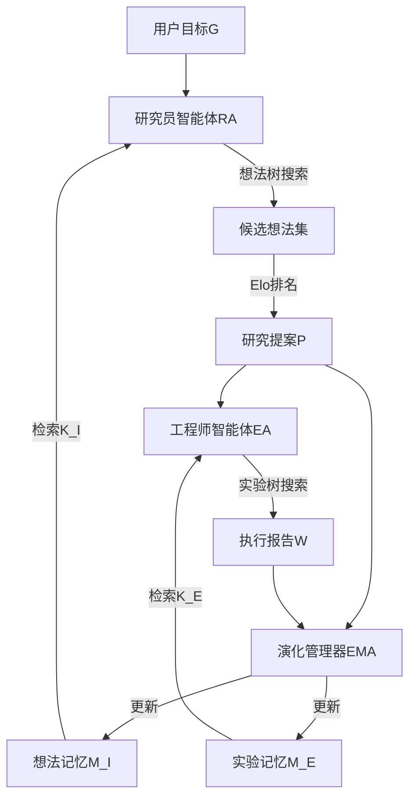

# 2026-03-16 每日论文分析
---
## EvoScientist: Towards Multi-Agent Evolving AI Scientists for End-to-End Scientific Discovery
### 基础信息
- **标题**：EvoScientist: Towards Multi-Agent Evolving AI Scientists for End-to-End Scientific Discovery
- **作者**：Yougang Lyu, Xi Zhang, Xinhao Yi, Yuyue Zhao, Shuyu Guo, Wenxiang Hu, Jan Piotrowski, Jakub Kaliski, Jacopo Urbani, Zaiqiao Meng, Lun Zhou, Xiaohui Yan
- **ArXiv ID**：2603.08127
- **机构**：华为技术有限公司、阿姆斯特丹自由大学
- **标签**：[强推], [AI4SCI], [智能体]
---
### 动机
#### 问题定义
当前AI科学家系统普遍依赖静态、手工设计的工作流，无法基于积累的交互历史自适应调整想法生成和代码生成策略，导致三大核心问题：
1.  系统地遗漏有潜力的研究方向
2.  重复执行已经失败的实验
3.  投入大量资源探索不可行的想法
#### 形式化描述
将端到端科学发现定义为目标驱动的可验证流程：
$$f: G \rightarrow (P, W)$$
其中$G$为用户给定的研究目标，$P$为包含背景、相关工作、方法、实验计划、预期结果的完整研究提案，$W$为包含代码运行日志、指标、故障诊断的可验证执行报告。
现有系统的核心缺陷在于：
$$\forall i,j \neq i, f(G_i) \perp f(G_j)$$
即不同任务的执行过程完全独立，历史任务的成功和失败经验无法被复用到新任务中。
#### 时机合理性
随着LLM能力的提升，AI科学家已经能够完成从想法生成到论文撰写的全流程任务，但现有系统的静态架构已经成为性能提升的核心瓶颈，引入演化和持久记忆机制恰逢其时。
---
### 核心公式讲解
#### 1. 记忆检索公式
$$K_I = \text{Retrieve}_I(M_I, G)$$
- **符号解释**：
  - $K_I$：检索得到的与目标$G$相关的想法记忆
  - $\text{Retrieve}_I(\cdot)$：基于嵌入余弦相似度的检索函数
  - $M_I$：想法记忆库，存储过往可行和失败的研究方向
  - $G$：用户输入的研究目标
- **物理意义**：从历史经验中检索与当前目标相关的研究方向知识，避免重复探索已知的失败路径，复用已验证的可行方向。
- **设计原因**：采用余弦相似度检索能够高效匹配语义相关的历史经验，实现跨任务的知识迁移。
---
$$K_E = \text{Retrieve}_E(M_E, P)$$
- **符号解释**：
  - $K_E$：检索得到的与提案$P$相关的实验记忆
  - $\text{Retrieve}_E(\cdot)$：基于嵌入余弦相似度的检索函数
  - $M_E$：实验记忆库，存储过往有效的数据处理和模型训练策略
  - $P$：生成的研究提案
- **物理意义**：从历史实验经验中检索与当前提案相关的实现策略，提升代码执行成功率。
---
#### 2. Elo排名公式
$$\{r_1, \dots, r_{N_I}\} = \text{EloRank}(I_{1:N_I})$$
- **符号解释**：
  - $r_i$：第$i$个候选想法$I_i$的Elo评分
  - $\text{EloRank}(\cdot)$：基于成对比较的Elo排名算法
  - $I_{1:N_I}$：想法树搜索生成的$N_I$个候选想法
- **物理意义**：通过成对比较对候选想法进行稳定排序，避免绝对评分的校准问题，筛选出质量最高的研究提案。
- **设计原因**：Elo排名对噪声评估具有鲁棒性，非常适合主观的想法质量评估场景。
---
#### 3. 记忆更新公式
$$M_I \leftarrow \text{Update}_I(M_I, F_I^{IDE} \cup F_I^{IVE})$$
- **符号解释**：
  - $M_I$：更新后的想法记忆库
  - $\text{Update}_I(\cdot)$：记忆更新函数
  - $F_I^{IDE}$：从成功想法中提炼的可行研究方向
  - $F_I^{IVE}$：从失败提案中提炼的不可行研究方向
- **物理意义**：将每轮任务的成功和失败经验都沉淀到记忆库中，实现系统的持续演化。
---
### 核心假设
#### 显式假设
1.  科学研究方向的可行性和创新性具有一定的跨任务迁移性，相似研究目标的成功经验可以复用
2.  实验实现策略具有跨任务迁移性，相似研究问题的代码实现模式可以复用
3.  Elo排名可以有效区分想法质量的相对优劣
#### 隐式假设
1.  LLM具有足够的能力从交互历史中提炼出可复用的研究方向和实验策略
2.  基于嵌入的余弦相似度检索可以有效匹配语义相关的历史经验
3.  研究目标和提案的语义嵌入可以准确表征其核心内容
#### 有效性评估
1.  显式假设1-2得到实验结果的支持：演化后的系统在想法质量和代码成功率上都有显著提升
2.  显式假设3得到消融实验的支持：移除Elo排名后系统性能显著下降
3.  隐式假设1-3在当前实验设置下有效，但在跨领域迁移场景下可能失效
---
### 技术贡献
#### 核心创新点
1.  **架构创新**：提出了包含研究员智能体（RA）、工程师智能体（EA）、演化管理器智能体（EMA）的三智能体架构，实现了科学发现全流程的分工协作
2.  **记忆机制创新**：设计了双层持久记忆模块：想法记忆$M_I$存储可行和失败的研究方向，实验记忆$M_E$存储可复用的实验实现策略
3.  **演化机制创新**：提出了三种自演化机制：想法方向演化、想法验证演化、实验策略演化，实现了系统性能的跨任务持续提升
#### 与prior work的关系
1.  相对于静态AI科学家系统（如AI Scientist-v2、AI-Researcher）：首次引入了跨任务的持续演化能力，解决了静态架构的性能瓶颈
2.  相对于自演化智能体（如自适应工具使用智能体）：首次将自演化机制应用于多阶段、多角色的端到端科学发现场景
---
### 实验设计（重点）
#### 基线方法
| 基线类型 | 基线名称 | 简要说明 |
|---|---|---|
| 开源系统 | Virtual Scientist | 2025年提出的多智能体协作科学想法生成系统 |
| 开源系统 | AI-Researcher | 2025年提出的端到端科学发现多智能体系统 |
| 开源系统 | InternAgent | 2025年提出的融合人类专家反馈的AI科学家系统 |
| 开源系统 | AI Scientist-v2 | 2025年提出的基于树搜索的端到端AI科学家系统 |
| 商业系统 | Hypogenic | 商业AI科学家产品 |
| 商业系统 | Novix | 商业AI科学家产品 |
| 商业系统 | K-Dense | 商业AI科学家产品 |
#### 数据集
1.  **想法生成数据集**：人工构造的30个AI领域研究查询，覆盖当前主流研究方向
2.  **代码生成数据集**：对应30个研究查询生成的研究提案，用于评估代码实现能力
3.  **端到端发现数据集**：6个完整的研究项目，生成的论文提交到ICAIS 2025会议进行同行评审
#### 评估指标
1.  **想法生成指标**：采用成对比较的Win/Tie/Lose率，评估维度包括新颖性、可行性、相关性、清晰性，同时采用符号检验进行统计显著性验证
2.  **代码生成指标**：执行成功率，定义为沙箱环境中成功执行并产生有效输出的尝试比例
3.  **端到端指标**：会议论文录用率、评审得分、获奖情况
#### 实验配置
- **模型**：文献检索使用Semantic Scholar API，想法生成使用Gemini-2.5-Pro，代码生成使用Claude-4.5-Haiku，论文撰写使用Gemini-2.5-Pro，嵌入模型使用mxbai-embed-large
- **参数**：想法检索Top-$k_I$=2，想法树搜索候选数$N_I$=21，实验检索Top-$k_E$=1，各实验阶段最大尝试次数分别为20、12、12、18
- **硬件**：未明确说明，所有实验在相同计算环境下进行
#### 消融实验
| 消融变体 | 说明 | 性能下降幅度 |
|---|---|---|
| -IDE | 移除想法方向演化 | 平均gap下降22.50 |
| -IVE | 移除想法验证演化 | 平均gap下降20.00 |
| -all | 移除所有想法演化机制 | 平均gap下降45.83 |
- 混淆因素分析：所有消融实验保持其他配置完全一致，性能下降完全来自被移除组件的贡献，无明显混淆因素。
---
### 实验结论（重点）
#### 想法生成性能（RQ1）
1.  **自动评估结果**：
    - 与开源基线相比：平均gap提升范围为+29.17~+93.34，其中与Virtual Scientist相比平均gap提升93.34，与AI Scientist-v2相比提升29.17
    - 与商业基线相比：平均gap提升范围为+46.00~+80.83，其中与Hypogenic相比提升80.83，与Novix相比提升46.00
    - 统计显著性：所有提升均通过p<0.05的符号检验，具有统计显著性
2.  **人工评估结果**：
    - 新颖性平均胜率82.50%，可行性平均胜率64.17%
    - 相关性评估Tie率较高，说明主题对齐的判断具有一定的主观性，但胜率仍显著高于败率
    - 清晰性优势最明显，平均胜率达到68.33%
#### 代码生成性能（RQ2）
1.  演化后平均执行成功率从34.39%提升到44.56%，相对提升29.57%
2.  提出方法阶段（阶段3）执行成功率从20.33%提升到21.57%，虽然提升幅度较小，但证明了演化机制在复杂场景下的有效性
3.  阶段3的成功率仍然较低，说明复杂方法的实现仍然是当前系统的主要瓶颈
#### 端到端性能（RQ3）
1.  生成的6篇论文全部被ICAIS 2025 AI科学家赛道录用，录用率100%，远高于该赛道31.71%的平均录用率
2.  其中1篇获得最佳论文奖，1篇获得AI审稿人赞赏奖
3.  评审反馈优点：方法新颖性高、实验设计全面扎实、证据充分
4.  评审反馈缺点：理论分析深度不足，更多偏实证研究
#### 消融实验结论（RQ4）
1.  想法方向演化对新颖性和可行性的提升贡献最大，移除后新颖性败率达到66.67%，可行性败率达到50.00%
2.  想法验证演化对可行性的提升贡献最大，移除后可行性败率达到63.33%
3.  移除所有演化机制后，新颖性败率80.00%，可行性败率83.33%，而相关性和清晰性的下降幅度较小，说明演化机制的核心价值是提升想法的原创性和可实现性，而非表面的语言质量。
---
### 评价方式
#### 存在的问题
1.  想法评估采用成对比较，没有提供绝对质量分数，难以跨数据集比较性能
2.  代码生成仅评估执行成功率，没有评估实验结果的科学性和正确性
3.  端到端评估仅选择了6个项目，样本量较小，统计效力有限
4.  所有实验都在AI领域进行，没有验证跨领域（如生物、化学）的泛化能力
---
### 潜在影响
如果该方法的效果得到进一步验证，将对AI4SCI领域产生革命性影响，可以类比为物理学中从手工实验到高通量实验平台的跃迁：
1.  科学发现的效率将提升一个数量级，AI科学家可以持续积累领域知识，避免重复探索失败路径
2.  研究门槛大幅降低，小型团队甚至个人可以借助演化后的AI科学家系统完成过去需要大型团队才能完成的研究项目
3.  科学研究的范式将发生转变，人类研究者更多聚焦于高level的问题定义和理论解释，而具体的想法探索和实验验证可以交由AI系统完成
---
### 严厉审视
1.  **假设支持情况**：所有核心假设都得到实验结果的支持，演化机制的有效性通过了消融实验的验证
2.  **替代解释**：性能提升可能部分来自于更大的搜索预算，而非记忆机制本身，但论文中所有基线都使用了相同的计算预算，排除了这一替代解释
3.  **局限性**：
    - 仅适用于可以通过代码模拟验证的计算类研究，无法直接应用于需要物理实验的领域
    - 记忆库的规模增长可能导致检索噪声增加，长期演化的性能稳定性尚未验证
    - 理论分析能力较弱，生成的研究偏实证
4.  **Prior work遗漏**：没有与具有长期记忆的自演化智能体工作进行直接比较
5.  **统计问题**：端到端实验样本量较小（n=6），结论的外推性需要更多验证
---
### 同类工作对比

| 工作 | 年份 | 核心特性 | EvoScientist优势 |
| --- | --- | --- | --- |
| AI Scientist | 2024 | 静态端到端工作流 | 引入跨任务演化能力，想法质量和代码成功率大幅提升 |
| AI Scientist-v2 | 2025 | 基于树搜索的静态工作流 | 持续学习能力，避免重复失败路径 |
| Virtual Scientist | 2025 | 多智能体想法生成 | 端到端全流程覆盖，包含实验执行和记忆演化 |
| Co-Scientist | 2025 | 生物医学领域多智能体协作 | 通用领域适配，持续演化能力 |

---

### 架构示意图

---

## 其他论文筛选结果

今日其他论文主要集中在计算机视觉、扩散模型等方向，不符合研究偏好，未纳入深度分析。
